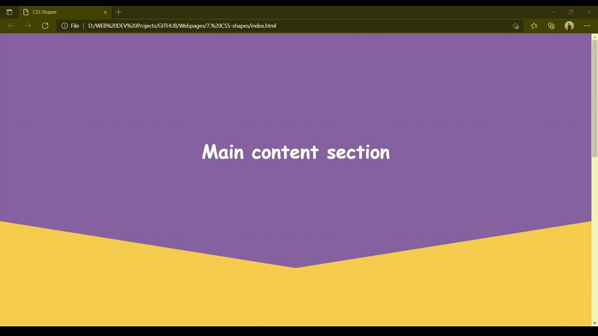

# Webpages 
### Different responsive webpages created by me using raw html css and little bit of javascript 
---

 

1. FCC-Portfolio Website
    

 

2. FCC-Product Landing Page
    

 

3. FCC-Tribute Website
    

 

4. FCC-Survey-form
    

 

5. FCC- Technical Documentation Page
    

 

6. Basic Responsive webpage
    

 

7. CSS-Shapes fun
    

 

8. Gradient-fun page
    

 

#### Hope to continue more intutive designs in future